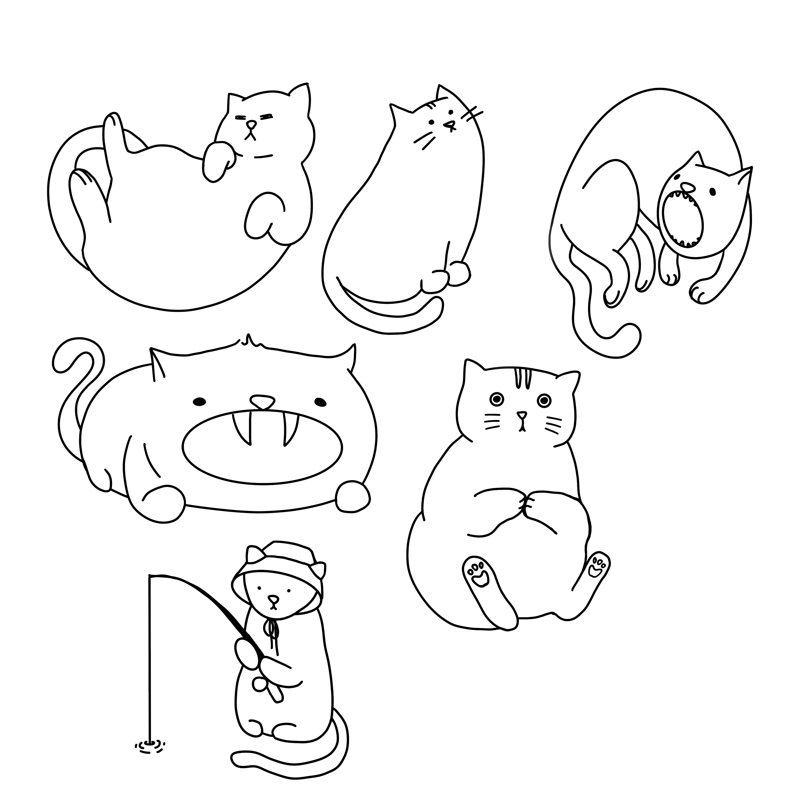
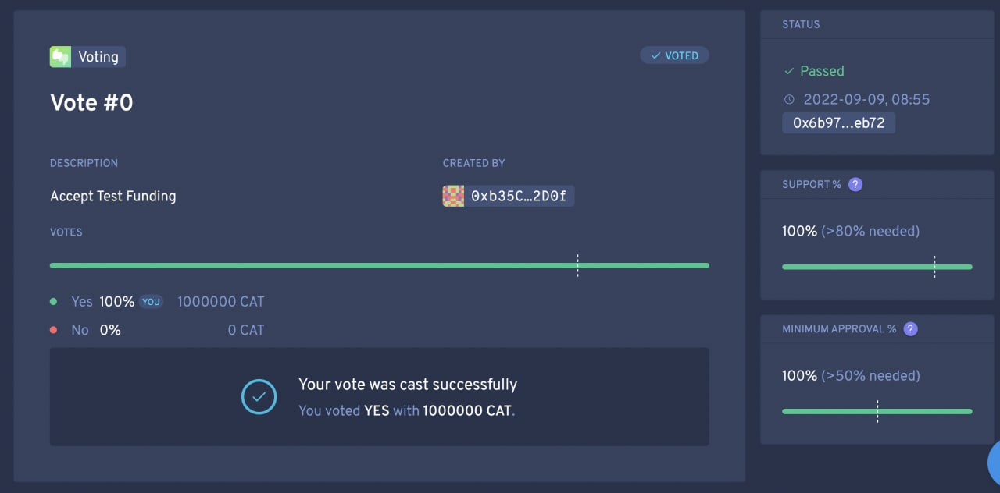
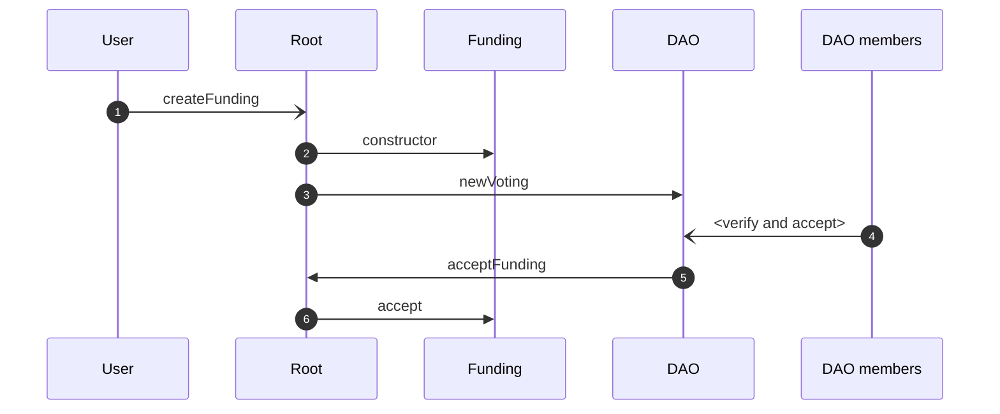
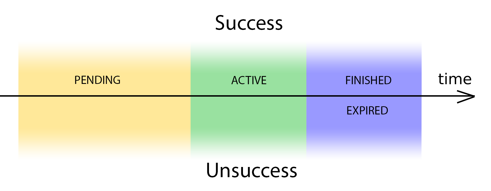
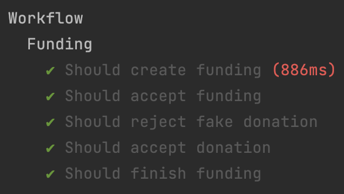

# Feed The Cat

Project Github: [https://github.com/tonred/FeedTheCat](https://github.com/tonred/FeedTheCat)

Polygon Root: `0x906A7aB761d9137A6B64F7F7b532F3f9458498Ff`

Website: [https://feedthecat.org](https://feedthecat.org)

DAO (Aragon): [https://client.aragon.org/#/feedthecat/](https://client.aragon.org/#/feedthecat/) at `0x9Ea69F795c34308491945E816Afb1C8f06044446`

Platform for creating safe funding to help Ukraine. Donators will receive NFTs
as a reward for donation and have ability to help with validation of fundings



## Key features:
* Approve funding via DAO
* Multiple fundings support
* Global and local NFT rewards for donation
* Staking NFTs to allow active donators to validate fundings (in progress)

## Technologies:
* Polygon blockchain
* Solidity `^0.8.9`
* Hardhat as dev env
* IPFS for storing files
* Aragon as a DAO

## Workflow

### Fundings
The main entity of the platform. Every funding is an independent contract
with own vault. The workflow is next:
1) Anyone can create proposal and put it in DAO for voting
2) DAO consists of trusted persons that verify all documents, and accept
proposal if funding is really needed
3) Funding appears in list of active fundings
4) 
    * If funding collected target amount, the creator can withdraw tokens
    and add reports (as IPFS files)
    * If funding expired and target amount is not reached, donators can
    refund their tokens

### Donates and rewards
In order to motivate people to donate, they will receive NFTs while
they make a progress in donations. There global rewards that shared
between all fundings, and local rewards for every funding. The workflow is next:
1) Donators can choose a favorite fundings from list and support them
2) As a reward, donators will receive NFTs
3) Reward NFTs can be staked in order to receive limited amount of DAO tokens.
Using these tokens, top donators can help DAO members to validate fundings (in progress)

[Sample of reward NFT](https://polygonscan.com/token/0x1320643c3d4544156fbbedfb5e42e10da6d206eb)

### DAO (Aragon)
DAO consists of trusted persons that verify all documents, and accept
proposal if funding is really needed. These persons have 90% of DAO tokens.
Other 10% will distribute among top donators

Besides this, DAO members can emergency stop any funding in any moments.
Also, they can add new NFT global rewards



## Technical description

### Root
Source code: [Root.sol](contracts/Root.sol)

Main contract which contains fundings list, donators statistics and
global NFTs. Also used to proxy DAO decisions to fundings

Root constructor must include:
1) `dao` - address of Aragon DAO
2) `defaultToken` - address of ERC20 token in which the fundings is made (usually USDT)
3) `nfts` - list of global NFTs and requirements for them
4) `nftUri` - uri for global nfts (see more in [ERC1155](https://github.com/OpenZeppelin/openzeppelin-contracts/blob/master/contracts/token/ERC1155/ERC1155.sol#L35))

<details>
<summary>Click here to see main function for Root</summary>

```solidity
function createFunding(FundingInfo calldata info, File[] calldata files, NFTInfo[] calldata nfts) external;
function acceptFunding(uint32 fundingID) external;
function processDonation(uint32 fundingID, address donator, uint256 amount) external;
function emergencyFinish(uint32 fundingID) external;
```

</details>

### Funding
Source code: [Funding.sol](contracts/Funding.sol)

Every funding must have:
1) Funding Info (see [FundingInfo.sol](contracts/structs/FundingInfo.sol)
    * `title` - short name of funding
    * `description` - full description of funding
    * `nftUri` - uri for local nfts (see more in [ERC1155](https://github.com/OpenZeppelin/openzeppelin-contracts/blob/master/contracts/token/ERC1155/ERC1155.sol#L35))
    * `target` - target amount (balance) of funding
    * `spender` - account of person who is responsible for funding,
    this account can withdraw collected tokens and add reports
    * `duration` - duration of funding in seconds (from time when DAO accept it)
2) Files that proofs reality of funding and reality of creator
3) List of NFTs that will be created only for this funding,
and requirements for getting them. NFT is ERC1155 compatible token

**Creating of funding:**


Funding can have such states (see [FundingState.sol](contracts/structs/FundingState.sol)):
1) `PENDING` - funding is waiting for DAO accepting
2) `ACTIVE` - anyone can donate to support it
3) `EXPIRED` - time finished, but funding is not complete, all donators
can refund their contribution
4) `FINISHED` - funding successfully finished, creator can withdraw tokens
and add reports

Timeline of states


<details>
<summary>Click here to see main function for Funding</summary>

```solidity
function state() external view returns (FundingState);
function accept() external;
function donateDefault(uint256 amount) external;
function refund() external;
function withdraw(address to, uint256 amount) external;
function addReports(File[] calldata reports) external;
function emergencyFinish() external;
```

</details>

### Structures
1) [NFTInfo.sol](contracts/structs/NFTInfo.sol) - requirement for getting this NFT:
    * `minAmount` - min amount of donation in tokens
    * `minCount` - min count of donation repeats for local NFTs, and min unique fundings for global
    * `onlyTop1`, `onlyTop2`, `onlyTop3` - only for local NFTs, means that it should be rewarded for
    specific place in top
    * `special` - only for global NFTs, means this logic of this reward described in root contract
2) [File.sol](contracts/structs/File.sol) - description of IPFS file
3) [DonatorData.sol](contracts/structs/DonatorData.sol) - data about each donator
4) [FundingState.sol](contracts/structs/DonatorData.sol) and [FundingInfo.sol](contracts/structs/FundingInfo.sol) - see above in Funding part

## Tests
Main functionality is covered with tests, check report bellow


# Slava Ukraini!
